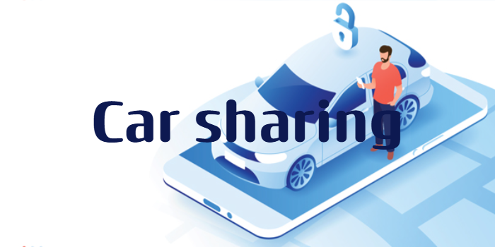
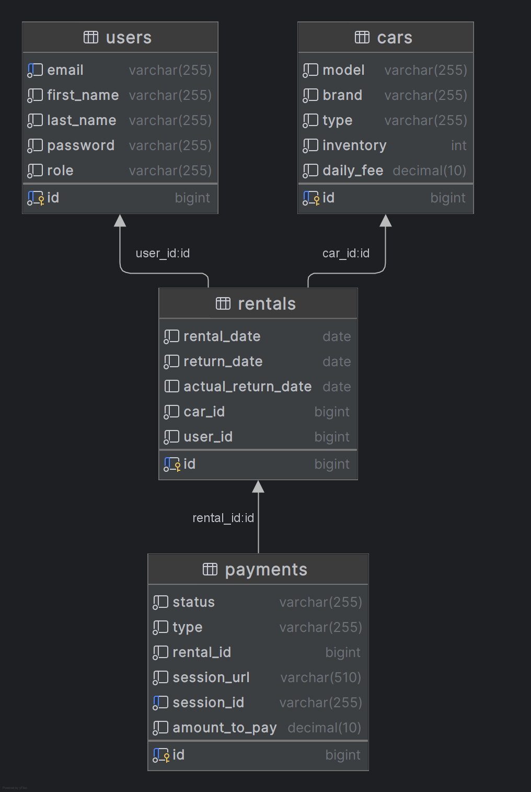

<h1>
 
</h1>

<p align="center">
  <a href="#introduction">Introduction</a>  •
  <a href="#technologies-used">Technologies used</a>  •
  <a href="#database-structure">Database structure</a>  •
  <a href="#project-controllers">Project controllers</a>  •
  <a href="#setup">Setup</a> •
  <a href="#run">Run</a> •
  <a href="#swagger">Swagger</a> •
  <a href="#postman-collection">Postman Collection</a> 
</p>

# Online Car sharing application

---

## Introduction

---
This online car sharing application designed to simplify cars rental and providing experience for both customers and
managers
User can find a vehicle of his taste by specific parameters, rent it and successfully pay for rental.

## 💡 Technologies used

---

- **Spring Boot**: Core framework for building an application.
- **Spring Boot Web**: Enables the development of RESTful web services and handles HTTP requests and responses.
- **Spring Security**:  Handles authentication and authorization.
- **Spring Data JPA**: Manages data access persistence.
- **Stripe Payment**: processing platform used for handling car rental payments.
- **Telegram Messaging service** :used for notifications.
- **Hibernate**: Default JPA implementation for ORM.
- **MySQL**: Primary relational database.
- **JWT(Provides JSON Web token)**:  Provides secure authentication.
- **Liquibase**: Manages database migrations.
- **Lombok**: Reduces boilerplate code.
- **Docker**: Containerization for deployment.
- **MapStruct**: Simplifies entity-to-DTO mappings.
- **Testcontainers**: Facilitates integration testing with Docker.
- **Swagger**: Generates and visualizes API documentation.

<div align="right"><kbd><a href="#online-car-sharing-application">↑ Back to top ↑</a></kbd></div>

## 🛢️ Database structure

---
<h1>
 
</h1>
<div align="right"><kbd><a href="#online-car-sharing-application">↑ Back to top ↑</a></kbd></div>

## Project controllers

---
🔐 Token-based authentication is implemented in the API.
You must get a JSON Web Token (JWT) and include it in the Authorization header.

<details>
  <summary>Registration</summary>

* Endpoint ```/register```
* HTTP Request: POST
* Request Body:
  ``` 
  {
  "email": "string",
  "password": "string",
  "repeatPassword": "string",
  "firstName": "string",
  "lastName": "string"
  }
  ```
* Response: Status Code 200
* Response Body:
  ``` 
  {
  "id": 0,
  "email": "string",
  "firstName": "string",
  "lastName": "string",
  }
  ```

</details>

<details>
  <summary>Login</summary>

* Endpoint ```/login```
* HTTP Request: POST
* Request Body:
  ``` 
  {
  "email": "string",
  "password": "string"
  }
  ```
* Response: Status Code 200
* Response Body:
  ``` 
  {
  "token": "string"
  }
  ```

</details>

---

Application supports two roles: `Customer` and `Manager`. `Customer` role is automatically assigned after registration.
If you want to assign an Manager role you have to create a Liquibase script or write SQL query.

<details>
    <summary> 
        <h2 style="display: inline; font-size: 1.15em; font-weight: bold; font-family: 'Arial', sans-serif;">
            Authentication Controller
        </h2>
    </summary>

| Http method | Endpoint  | Description   | 
|-------------|-----------|---------------|
| Post        | /register | Register user |
| Post        | /login    | Login user    |

</details>
<details>
    <summary> 
        <h2 style="display: inline; font-size: 1.15em; font-weight: bold; font-family: 'Arial', sans-serif;">
            Cars Management
        </h2>
    </summary>

| Http method | Endpoint   | Description                           | 
|-------------|------------|---------------------------------------|
| Post        | /cars      | Create a new car (MANAGER only)       |
| Get         | /cars      | Get all cars                          |
| Get         | /cars/{id} | Get car by id                         |
| Put         | /cars/{id} | Update a car (MANAGER only)           |
| Patch       | /cars/{id} | Update a car inventory (MANAGER only) |
| Delete      | /cars/{id} | Delete a car (MANAGER only)           |
</details>
<details>
    <summary> 
        <h2 style="display: inline; font-size: 1.15em; font-weight: bold; font-family: 'Arial', sans-serif;">
            Users Management
        </h2>
    </summary>

| Http method | Endpoint         | Description                              | 
|-------------|------------------|------------------------------------------|
| Put         | /users/{id}/role | Update a user role (MANAGER only)        |
| Get         | /users/me        | Get user profile info                    |
| Put         | /users/me        | Update user profile info (CUSTOMER only) |
</details>
<details>
    <summary> 
        <h2 style="display: inline; font-size: 1.15em; font-weight: bold; font-family: 'Arial', sans-serif;">
            Rentals Management
        </h2>
    </summary>
| Http method | Endpoint              | Description                         | 
|-------------|-----------------------|-------------------------------------|
| Post        | /rentals              | Create a new rental (CUSTOMER only) |
| Get         | /rentals              | Get rentals by params               |
| Get         | /rentals/{id}         | Get rental by id                    |
| Post        | /rentals//{id}/return | Return Rental (MANAGER only)        |
</details>
<details>
    <summary> 
        <h2 style="display: inline; font-size: 1.15em; font-weight: bold; font-family: 'Arial', sans-serif;">
            Payments Managment
        </h2>
    </summary>

| Http method | Endpoint          | Description                              | 
|-------------|-------------------|------------------------------------------|
| Get         | /payments/{id}    | Get payments (is authenticated)          |
| Post        | /payments         | Create payment session (CUSTOMER only)   |
| Get         | /payments/success | Handle successful payment (MANAGER only) |
| Get         | /payments/cancel  | Handle cancel payment (MANAGER only)     |
</details>

<div align="right"><kbd><a href="#online-car-sharing-application">↑ Back to top ↑</a></kbd></div>

## ⚙ Setup

---

### Using

1. Clone repository:
    ```bash
      git clone https://github.com/DojiDoe/car-sharing-app.git
   ```
2. Navigate to project directory:
   ```bash
   cd car-sharing-app
    ```
3. Build a project:
    ```bash
    mvn clean install
    ```
4. Set up the .env.template file:

- Rename .env.template to .env.
- Fill in the required environment variables:
    ```bash
    SPRING_DATASOURCE_URL=your_spring_datasource_url
    SPRING_DATASOURCE_USERNAME=your_spring_datasource_username
    SPRING_DATASOURCE_PASSWORD=your_spring_datasource_password
    MYSQL_LOCAL_PORT=your_mysql_local_port
    MYSQL_DB_DOCKER_PORT=your_mysql_db_docker_port
    SPRING_LOCAL_PORT=your_spring_local_port
    SPRING_DOCKER_PORT=your_mysql_db_docker_port
    DEBUG_PORT=your_debug_port
    STRIPE_SECRET_KEY=your_stripe_secret_key
    TELEGRAM_BOT_TOKEN=your_telegram_bot_token
    TELEGRAM_CHAT_NAME=your_telegram_chat_name
    CHAT_ID=your_chat_id
   ```
### Payment with Stripe 💸
This project integrates with the Stripe API for payment processing. Follow these steps to set up test keys:

<details>
<summary>Instructions 🛠️</summary>

1. <h4>Create a Stripe Account:</h4>
- Go to [Stripe's website](https://stripe.com/) and create a new account.

2. <h4>Access Test Keys:</h4>
- Log in to your Stripe Dashboard, and navigate to the "Developers" section.
  Here, you'll find your test API keys under "API keys."

3. <h4>Configure Keys:</h4>
- Add these test keys to your application.properties or environment variables for local development.
  Replace the placeholder keys with your actual Stripe test keys.

</details>

### Notifications with Telegram 🔔
The project uses the Telegram API to send notifications. Follow these steps to set up your Telegram bot:

<details>
<summary>Instructions 🛠️</summary>

1. <h4>Create a Telegram Bot:</h4>
- Open the Telegram app and search for the "BotFather" bot.
- Start a chat with BotFather and use the `/newbot` command to create a new bot.
- Follow the instructions to get your bot token.

2. <h4>Configure the Bot:</h4>
- Add the bot token to your project’s configuration file or environment variables.
- Ensure your application uses this token to communicate with the Telegram API.

3. <h4>Get Your Chat ID:</h4>
- Start a chat with your bot in Telegram.
- Send any message to the bot.
- Visit the following URL in your browser, replacing `YOUR_BOT_TOKEN` with your actual bot token:

     ```plaintext
     https://api.telegram.org/botYOUR_BOT_TOKEN/getUpdates
     ```

- Look for the chat object in the JSON response. Your chat ID will be under `chat.id`.

</details>

## 🚀 Run

---

### 🏚️ Locally

```bash
mvn spring-boot:run
```

### 🐳 Docker

1. Install Docker.
2. Create a Docker image:
    ```bash
   docker build -t car-sharing-app .
    ```
3. Run the Docker container:
    ```bash
   docker-compose up
    ```
4. The application will be accessible at http://localhost:SPRING_LOCAL_PORT (replace SPRING_LOCAL_PORT with the port you
   configured in .env).

<div align="right"><kbd><a href="#online-car-sharing-application">↑ Back to top ↑</a></kbd></div>

## Swagger API

---
You can access the [Swagger Ui](http://localhost:8080/swagger-ui/index.html#/) to explore the API endpoints,
request/response models, and test the APIs interactively.

## Postman Collection

---

### For quick start:

- Open Postman and import [car sharing collection.](src/main/resources/postman/CarSharing.postman_collection.json)
- Test API endpoints following included documentation.

> **Note:** Before testing endpoints make sure application is running, and you have stable coonnection to database.
<div align="right"><kbd><a href="#online-car-sharing-application">↑ Back to top ↑</a></kbd></div>
